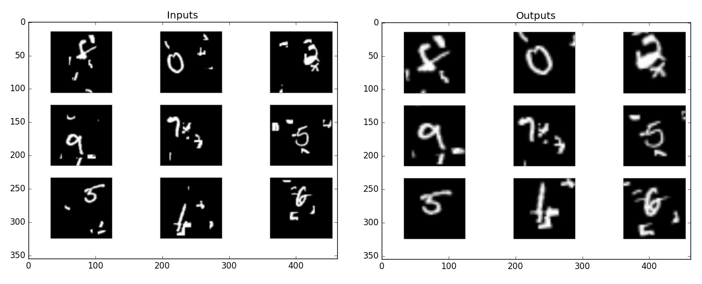

# Spatial transformer networks
Implementation of spatial transformer networks in keras 2.0 using tensorflow 1.0 as backend.




## Functional API usage

```python 
locnet = [Network]
locnet = Lambda(lambda x: spatial_transformer(affine_transformation=x,
                                              input_shape=input_img,
                                              output_size=(30,30)),
                output_shape = (30,30,1))(locnet)
```
